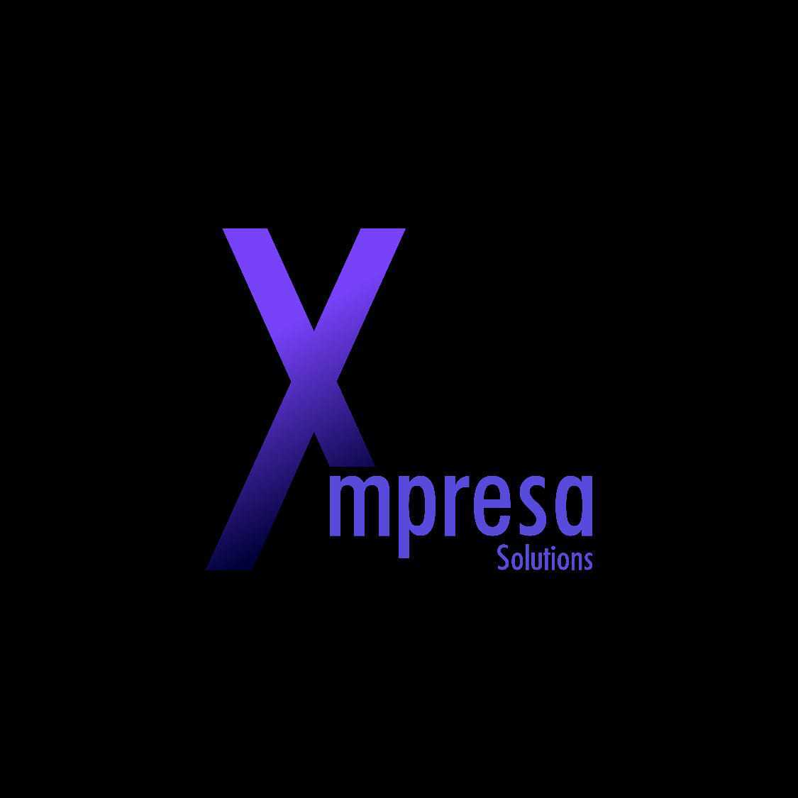

# Welcome to Xmpresa Organization

## About Us

Xmperesa Organization is dedicated to building world class apps. We focus on improoving bussiness with technology, specifically software engineering.

## Our Projects

We host a variety of projects aimed at [brief description of the projects' goals and objectives]. Here are some of our main projects:

- **[Our Company's Website](https://github.com/Xmpresa//project1)**: This is our Company's Website.

## Getting Involved

We welcome contributions from the community! Here are a few ways you can get involved:

- **Report Issues**: If you find a bug or have a suggestion, please report it in the relevant project's issue tracker.
- **Contribute Code**: Check out our [contribution guidelines](https://github.com/Xmpresa/.github/blob/main/CONTRIBUTING.md) to learn how you can contribute.
- **Join the Discussion**: Participate in our [discussion forums](https://github.com/orgs/Xmpresa/discussions) or join our [chat channel](https://gitter.im/abc/community).

## Code of Conduct

We expect all participants to adhere to our [Code of Conduct](https://github.com/Xmpresa/.github/blob/main/CODE_OF_CONDUCT.md). Please read it to understand the expectations for behavior in our community.

## Contact Us

If you have any questions or need further information, please feel free to contact us at contact@Xmperasa.org.

---

Thank you for being a part of Xmperesa! Together, we can make a difference.
